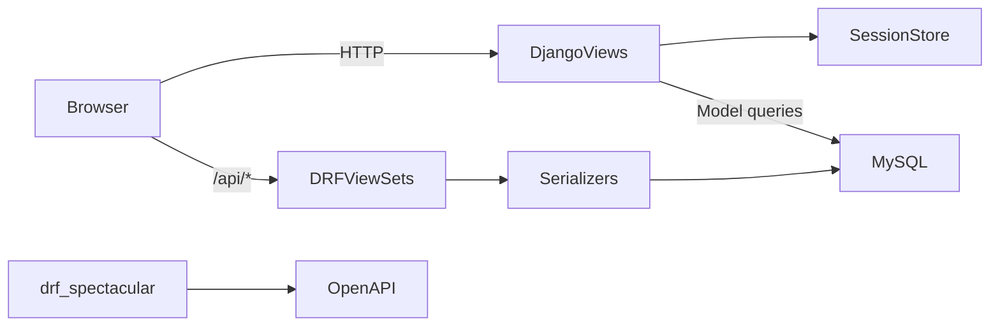

# Luna — Sistema de Gestión

[](https://www.python.org/)
[](https://www.djangoproject.com/)
[](https://www.django-rest-framework.org/)
[](https://www.mysql.com/)
[]()

Luna es un sistema web desarrollado con Django para gestionar usuarios y personas, y además expone una API REST con Django REST Framework para consultar y actualizar datos del sistema.

## Tabla de contenido

- [Descripción](#descripción)
- [Objetivo](#objetivo)
- [Características principales](#características-principales)
- [Tecnologías utilizadas](#tecnologías-utilizadas)
- [Arquitectura](#arquitectura)
- [Estructura del proyecto](#estructura-del-proyecto)
- [Módulos del sistema](#módulos-del-sistema)
- [Base de datos](#base-de-datos)
- [API REST](#api-rest)
- [Swagger / OpenAPI](#swagger--openapi)
- [Instalación](#instalación)
- [Configuración](#configuración)
- [Uso del sistema](#uso-del-sistema)
- [Seguridad](#seguridad)
- [Pruebas](#pruebas)
- [Capturas de pantalla](#capturas-de-pantalla)
- [Documentación técnica](#documentación-técnica)
- [Roadmap](#roadmap)
- [Autor](#autor)
- [Licencia](#licencia)

## Descripción

Luna es una aplicación Django orientada a la gestión interna de información de personas y usuarios. El proyecto combina una capa web basada en templates de Django con una API REST para manejar datos de forma estructurada y accesible.

La implementación observada en el código incluye:

- Registro y administración de usuarios con autenticación por sesión.
- Registro, búsqueda y filtrado de personas.
- Relación de referidos dentro de la misma entidad `Person`.
- Dashboard con estadísticas resumidas de usuarios y personas.
- API REST con endpoints para `person` y `user` usando DRF.
- Documentación automática con `drf-spectacular`.

## Objetivo

El objetivo actual del sistema es centralizar la administración de personas y usuarios en una interfaz web simple, con controles de acceso por sesión y una API para consulta y manipulación de registros.

No se observa en el código un módulo de facturación, inventario, ventas ni un sistema multi-tenant; la funcionalidad realmente implementada se centra en registros operativos básicos de personas, usuarios y estadísticas del sistema.

## Características principales

Las funcionalidades comprobadas en el código actual son:

- Gestión de usuarios con login y cierre de sesión.
- Control de acceso por sesión mediante decoradores personalizados.
- Restricción de acciones administrativas para usuarios con rol `Admin`.
- Gestión de personas con CRUD completo.
- Filtros por urbanización y por persona referente.
- Búsqueda por nombre, apellido, teléfono, correo y urbanización.
- Dashboard con conteos de usuarios, personas, urbanizaciones, referidos y administradores.
- API REST con ViewSets para personas y usuarios.
- Documentación OpenAPI/Swagger/ReDoc.
- Interfaz basada en templates de Django y CSS/JS estáticos.

## Tecnologías utilizadas

Las tecnologías que aparecen explícitamente en el proyecto son:

- Python
- Django 6.1
- Django REST Framework 3.18.0
- MySQL
- HTML
- CSS
- JavaScript
- drf-spectacular
- SQLite no se usa como base de datos principal; la configuración activa es MySQL.

Se verificó en la configuración y en el entorno del proyecto que las bibliotecas instaladas incluyen, al menos:

- Django
- djangorestframework
- drf-spectacular
- mysqlclient

No se encontró un archivo `requirements.txt` en la raíz del proyecto. La instalación actual del entorno local se realizó con el entorno virtual incluido en `venv/`.

## Arquitectura

### Arquitectura general

El proyecto sigue una arquitectura monolítica Django modular, con varios apps internas y una capa REST. La aplicación web renderiza templates del lado del servidor, mientras que la API REST expone endpoints JSON.

### Backend

- Proyecto principal: `sistema/`
- Apps Django: `user`, `person`, `dashboard`, `api`
- Base de datos: MySQL configurada en `sistema/settings.py`
- Autenticación custom: basada en sesión (`request.session['logueado']`) y decoradores `login_required_custom` / `admin_required`
- API: Django REST Framework + ViewSets + serializers

### Frontend

- Templates en `templates/` y dentro de cada app.
- Estilos en `static/css/`.
- JS auxiliar en `static/js/`.
- La interfaz principal se basa en HTML renderizado por Django y no en un SPA moderno.

### Aplicaciones Django

- `user`: autenticación, gestión de usuarios y permisos.
- `person`: gestión de personas, referidos y filtros.
- `dashboard`: resúmenes y métricas del sistema.
- `api`: endpoints REST y serialización.
- `sistema`: configuración global del proyecto.

### API REST

La API está montada bajo el prefijo `/api/` y utiliza `DefaultRouter` de DRF.

### Base de datos

La base de datos principal está configurada en MySQL. El proyecto usa migraciones de Django y define modelos concretos para `User`, `Person` y `Servicio`.

### Comunicación entre componentes



## Estructura del proyecto

La estructura real del proyecto es la siguiente:

```text
Luna/
├── api/
│   ├── migrations/
│   ├── __init__.py
│   ├── apps.py
│   ├── models.py
│   ├── serializers.py
│   ├── schema.py
│   ├── tests.py
│   ├── urls.py
│   └── views.py
├── dashboard/
│   ├── migrations/
│   ├── templates/
│   │   └── dashboard/
│   │       └── dashboard.html
│   ├── __init__.py
│   ├── apps.py
│   ├── tests.py
│   ├── urls.py
│   └── views.py
├── person/
│   ├── migrations/
│   ├── templates/
│   │   └── person/
│   │       ├── createperson.html
│   │       ├── deleteperson.html
│   │       ├── readperson.html
│   │       └── updateperson.html
│   ├── __init__.py
│   ├── apps.py
│   ├── form.py
│   ├── models.py
│   ├── tests.py
│   ├── urls.py
│   └── views.py
├── static/
│   ├── css/
│   │   ├── dashboard.css
│   │   ├── global.css
│   │   ├── login.css
│   │   └── luna.css
│   └── js/
│       ├── dashboard.js
│       └── login.js
├── sistema/
│   ├── __init__.py
│   ├── asgi.py
│   ├── context_processors.py
│   ├── settings.py
│   ├── urls.py
│   └── wsgi.py
├── templates/
│   ├── base.html
│   ├── base_dashboard.html
│   ├── dashboard.html
│   ├── login.html
│   ├── componentes/
│   └── usuarios/
├── user/
│   ├── migrations/
│   ├── templates/
│   │   └── user/
│   │       ├── createuser.html
│   │       ├── deleteuser.html
│   │       ├── login.html
│   │       ├── readuser.html
│   │       └── updateuser.html
│   ├── __init__.py
│   ├── apps.py
│   ├── decorators.py
│   ├── form.py
│   ├── models.py
│   ├── tests.py
│   ├── urls.py
│   └── views.py
├── manage.py
├── COMPONENTES_ADICIONALES.html
├── INDICE_COMPLETO.md
├── QUICK_START.md
├── README_DESIGN.md
└── ejemplo_views.py
```

### Descripción breve de carpetas clave

- `api/`: API REST y serialización.
- `dashboard/`: vista del panel principal y métricas.
- `person/`: registro y administración de personas.
- `user/`: autenticación, sesión y gestión de usuarios.
- `static/`: assets CSS y JS del frontend.
- `templates/`: layouts base y componentes compartidos.
- `sistema/`: configuración del proyecto Django.
- `venv/`: entorno virtual local del proyecto.

## Módulos del sistema

### 1. `user`

**Propósito:** autenticación y administración de usuarios del sistema.

**Funcionalidades reales:**

- Login con nombre de usuario y contraseña.
- Cierre de sesión.
- Listado de usuarios.
- Creación, edición y eliminación de usuarios.
- Validación de contraseña con hashing.
- Control de permisos por rol `Admin` y `Invitado`.

**Modelo relacionado:**

- `User`

**Vistas importantes:**

- `login_view`
- `ReadUser`
- `CreateUser`
- `UpdateUser`
- `DeleteUser`
- `logout_view`

**URLs relacionadas:**

- `/`
- `/logout/`
- `/user/`
- `/user/create/`
- `/user/update/<int:id>/`
- `/user/delete/<int:id>/`

### 2. `person`

**Propósito:** gestión de personas y referencias.

**Funcionalidades reales:**

- Registro de personas con datos básicos.
- Búsqueda general por texto.
- Filtros por urbanización y referente.
- Relación de referencia entre personas (`referido_por`).
- CRUD de personas.

**Modelo relacionado:**

- `Person`

**Vistas importantes:**

- `ReadPerson`
- `CreatePerson`
- `UpdatePerson`
- `DeletePerson`

**URLs relacionadas:**

- `/person/`
- `/person/create/`
- `/person/update/<int:id>/`
- `/person/delete/<int:id>/`

### 3. `dashboard`

**Propósito:** mostrar un resumen del estado del sistema.

**Funcionalidades reales:**

- Contador de usuarios.
- Contador de personas.
- Contador de urbanizaciones.
- Contador de referidos.
- Contador de usuarios admin.

**Modelo relacionado:**

- No define modelos propios.
- Consulta `User` y `Person`.

**Vista importante:**

- `dashboard_view`

**URL relacionada:**

- `/dashboard/`

### 4. `api`

**Propósito:** servir la API REST del sistema.

**Funcionalidades reales:**

- Listado y CRUD para `Person`.
- Listado y CRUD para `User`.
- Documentación OpenAPI con `drf-spectacular`.
- Autenticación con sesión o token.

**Modelos relacionados:**

- `Person`
- `User`
- `Servicio` (modelo definido pero no está conectado a ViewSet visible en URLs)

**Serializers:**

- `PersonSerializer`
- `UserSerializer`

**ViewSets:**

- `PersonViewSet`
- `UserViewSet`

**URLs relacionadas:**

- `/api/person/`
- `/api/person/<id>/`
- `/api/user/`
- `/api/user/<id>/`
- `/api/auth/`
- `/api/schema/`
- `/api/docs/`
- `/api/redoc/`

### 5. `sistema`

**Propósito:** configuración del proyecto Django y enrutado principal.

**Archivos relevantes:**

- `settings.py`
- `urls.py`
- `context_processors.py`

## Base de datos

### Modelos actuales

#### `user.User`

| Campo | Tipo | Descripción |
| --- | --- | --- |
| `id` | `BigAutoField` | Clave primaria |
| `nombre` | `CharField(max_length=254, unique=True)` | Nombre de usuario único |
| `contraseña` | `CharField(max_length=255)` | Contraseña almacenada en formato hash |
| `cargo` | `CharField(max_length=254, choices=[('Admin','ADMIN'), ('Invitado','INVITADO')])` | Rol del usuario |
| `fecha_creacion` | `DateTimeField(null=True, blank=True)` | Fecha de alta |

Métodos definidos:

- `set_password(raw_password)`: usa `make_password()`.
- `check_password(raw_password)`: usa `check_password()`.

#### `person.Person`

| Campo | Tipo | Descripción |
| --- | --- | --- |
| `id` | `BigAutoField` | Clave primaria |
| `nombre` | `CharField(max_length=100)` | Nombre |
| `apellido` | `CharField(max_length=100)` | Apellido |
| `telefono` | `CharField(max_length=20)` | Teléfono |
| `correo` | `EmailField(max_length=150, blank=True, null=True)` | Correo opcional |
| `edad` | `PositiveIntegerField()` | Edad |
| `urbanizacion` | `CharField(max_length=100)` | Urbanización |
| `referido_por` | `ForeignKey('self', on_delete=SET_NULL, null=True, blank=True)` | Referencia a otra persona |
| `fecha_creacion` | `DateTimeField(auto_now_add=True)` | Fecha de registro |
| `fecha_actualizacion` | `DateTimeField(auto_now=True)` | Última actualización |

Relación:

- Una persona puede tener varios `referidos`.
- Una persona puede ser referida por otra persona (`referido_por`).

#### `api.Servicio`

| Campo | Tipo | Descripción |
| --- | --- | --- |
| `id` | `BigAutoField` | Clave primaria |
| `nombre` | `CharField(max_length=254)` | Nombre del servicio |
| `costo` | `IntegerField` | Costo |
| `descripcion` | `TextField(blank=True, null=True)` | Descripción |
| `estado` | `CharField(choices=[('Activo','ACTIVO'), ('Inactivo','INACTIVO')], default='Activo')` | Estado |

### Diagrama ER

```mermaid
erDiagram
    USER ||--o{ : "gestiona"
    PERSON ||--o{ PERSON : "referido_por"
    PERSON {
        bigint id PK
        varchar nombre
        varchar apellido
        varchar telefono
        varchar correo
        int edad
        varchar urbanizacion
        bigint referido_por FK
        datetime fecha_creacion
        datetime fecha_actualizacion
    }

    USER {
        bigint id PK
        varchar nombre
        varchar contraseña
        varchar cargo
        datetime fecha_creacion
    }

    SERVICIO {
        bigint id PK
        varchar nombre
        int costo
        text descripcion
        varchar estado
    }
```

## API REST

### Base URL

La API REST se monta en:

- `/api/`

### Endpoints disponibles

| Método | Ruta | Descripción |
| --- | --- | --- |
| `GET` | `/api/person/` | Lista personas |
| `POST` | `/api/person/` | Crea una persona |
| `GET` | `/api/person/{id}/` | Consulta una persona |
| `PUT` | `/api/person/{id}/` | Reemplaza una persona |
| `PATCH` | `/api/person/{id}/` | Actualiza parcialmente una persona |
| `DELETE` | `/api/person/{id}/` | Elimina una persona |
| `GET` | `/api/user/` | Lista usuarios |
| `POST` | `/api/user/` | Crea un usuario |
| `GET` | `/api/user/{id}/` | Consulta un usuario |
| `PUT` | `/api/user/{id}/` | Reemplaza un usuario |
| `PATCH` | `/api/user/{id}/` | Actualiza parcialmente un usuario |
| `DELETE` | `/api/user/{id}/` | Elimina un usuario |

### Serializers

- `PersonSerializer`: serializa todos los campos de `Person` con `fields = '__all__'`.
- `UserSerializer`: serializa `User` excluyendo el campo `contraseña` (`exclude = ['contraseña']`).

### Permisos y autenticación

La configuración en `sistema/settings.py` define:

- `DEFAULT_PERMISSION_CLASSES = ['rest_framework.permissions.IsAuthenticatedOrReadOnly']`
- `DEFAULT_SCHEMA_CLASS = 'drf_spectacular.openapi.AutoSchema'`

Además, cada `ViewSet` redefine su configuración:

- `PersonViewSet`: `authentication_classes = [SessionAuthentication, TokenAuthentication]`; `permission_classes = [DjangoModelPermissionsOrAnonReadOnly]`
- `UserViewSet`: `authentication_classes = [SessionAuthentication, TokenAuthentication]`; `permission_classes = [IsAuthenticated]`

En la práctica, la interfaz web usa sesión, pero la API también intenta soportar autenticación por token.

### Códigos HTTP esperados

Los códigos más relevantes observados en DRF son:

- `200 OK`: lectura exitosa.
- `201 Created`: creación exitosa.
- `204 No Content`: eliminación exitosa.
- `401 Unauthorized`: no autenticado o sesión inválida.
- `403 Forbidden`: permisos insuficientes.
- `404 Not Found`: recurso inexistente.

## Swagger / OpenAPI

La documentación OpenAPI de la API está habilitada con `drf-spectacular`.

### Rutas reales

- `GET /api/schema/` — schema OpenAPI generado.
- `GET /api/docs/` — Swagger UI interactivo.
- `GET /api/redoc/` — interfaz ReDoc.

### Descripción

- `/api/schema/`: devuelve el esquema OpenAPI, útil para integración y automatización.
- `/api/docs/`: permite probar la API desde el navegador con Swagger UI.
- `/api/redoc/`: presenta la documentación en estilo ReDoc.

## Instalación

> Nota: No se encontró un archivo `requirements.txt` en la raíz del proyecto. Las dependencias se verificaron a partir del entorno virtual y la configuración activa del proyecto.

### 1. Clonar el repositorio

```bash
git clone <url-del-repositorio>
cd Luna
```

### 2. Crear entorno virtual

#### Windows (PowerShell)

```powershell
python -m venv venv
.\venv\Scripts\Activate.ps1
```

#### Windows (CMD)

```cmd
python -m venv venv
venv\Scripts\activate.bat
```

#### Linux/macOS

```bash
python3 -m venv venv
source venv/bin/activate
```

### 3. Instalar dependencias

```bash
python -m pip install --upgrade pip
pip install Django==6.1.0 djangorestframework==3.18.0 drf-spectacular==0.30.0 mysqlclient==2.2.8
```

### 4. Crear la base de datos MySQL

Se requiere una base de datos MySQL disponible localmente. En la configuración actual se usa `luna` y el motor `django.db.backends.mysql`.

```sql
CREATE DATABASE luna;
```

### 5. Ejecutar migraciones

```bash
python manage.py migrate
```

### 6. Ejecutar el proyecto

```bash
python manage.py runserver
```

La aplicación quedará disponible en:

- `http://127.0.0.1:8000/`

## Configuración

### Archivo principal

La configuración del proyecto está en:

- `sistema/settings.py`

### Datos obligatorios observados

- `SECRET_KEY`: valor hardcodeado en el código.
- `DEBUG = True`
- `ALLOWED_HOSTS = []`
- `INSTALLED_APPS`: incluye `django.contrib.*`, `rest_framework`, `drf_spectacular`, `person`, `user`, `dashboard`, `api`
- `DATABASES`: configuración MySQL local
- `STATIC_URL = '/static/'`
- `STATICFILES_DIRS = [BASE_DIR / 'static']`

### Variables de entorno

No existe un archivo `.env` ni una configuración de entorno en el repositorio. La configuración actual se define directamente en `settings.py`.

Se recomienda, si se desea preparar el proyecto para un entorno más seguro, mover los datos sensibles a variables de entorno, especialmente:

- `SECRET_KEY`
- `DB_NAME`
- `DB_USER`
- `DB_PASSWORD`
- `DB_HOST`
- `DB_PORT`

## Uso del sistema

### Acceso a la interfaz web

La ruta principal del sistema es:

- `/` → pantalla de inicio de sesión (`user.urls`)

Tras iniciar sesión correctamente, la aplicación redirige a:

- `/dashboard/`

### Gestión de usuarios

- `/user/` → listado de usuarios
- `/user/create/` → crear usuario
- `/user/update/<id>/` → editar usuario
- `/user/delete/<id>/` → eliminar usuario

### Gestión de personas

- `/person/` → listado de personas
- `/person/create/` → registrar persona
- `/person/update/<id>/` → editar persona
- `/person/delete/<id>/` → eliminar persona

### Dashboard

- `/dashboard/` → panel con estadísticas

### API

- `/api/person/` → personas via REST
- `/api/user/` → usuarios via REST
- `/api/auth/` → autenticación del navegador de DRF

## Seguridad

Las medidas de seguridad comprobadas en el código son:

- Middlware de CSRF activo: `django.middleware.csrf.CsrfViewMiddleware`
- Hashing de contraseñas con `make_password()` y `check_password()`
- Sesiones para autenticación de usuarios en `request.session['logueado']`
- Decoradores `login_required_custom` y `admin_required` para proteger vistas
- Validación de formularios con reglas de nombres, teléfonos y contraseñas
- Restricción de acceso para `UserViewSet` mediante `IsAuthenticated`
- `DEFAULT_PERMISSION_CLASSES` en DRF

Sin embargo, el proyecto tiene varios puntos que requieren atención si se quiere prepararlo para producción:

- `DEBUG = True`
- `SECRET_KEY` hardcodeado en `sistema/settings.py`
- `ALLOWED_HOSTS = []`
- No hay `.env` ni gestión de secretos por variables de entorno
- No se observa uso explícito de `rest_framework.authtoken` en `INSTALLED_APPS` aunque `TokenAuthentication` se referencia en los ViewSets
- La autenticación actual no usa el sistema nativo de Django `auth.User`, sino un modelo custom llamado `user.User`

Recomendaciones de mejora:

- Exponer configuración sensible mediante variables de entorno.
- Desactivar `DEBUG` en producción.
- Definir `ALLOWED_HOSTS` adecuados.
- Usar HTTPS.
- Añadir validación y logging adicional de seguridad.
- Revisar y completar la configuración de token authentication si se desea usar tokens en producción.

## Pruebas

Se revisaron los archivos `tests.py` de las apps y todos están vacíos o son placeholders:

```python
from django.test import TestCase

# Create your tests here.
```

### Estado actual

- No existen pruebas automatizadas implementadas.
- El comando actual de pruebas puede ejecutarse con:

```bash
python manage.py test
```

Resultado verificado en el proyecto actual:

```text
Found 0 test(s)
NO TESTS RAN
```

## Capturas de pantalla

No existen imágenes en el repositorio para este proyecto actualmente. Puedes usar los siguientes placeholders para agregarlas cuando se disponga de capturas reales:

```markdown
## 📸 Capturas de pantalla

### Inicio de sesión


### Dashboard


### Gestión de personas


### Gestión de usuarios


### Documentación de la API


```

## Documentación técnica

La documentación técnica realmente disponible dentro del proyecto es:

- `/api/schema/` — esquema OpenAPI
- `/api/docs/` — Swagger UI
- `/api/redoc/` — ReDoc
- `/admin/` — interfaz administrativa de Django

También existen archivos auxiliares en la raíz del proyecto, pero no constituyen documentación técnica oficial del proyecto:

- `QUICK_START.md`
- `INDICE_COMPLETO.md`
- `README_DESIGN.md`
- `COMPONENTES_ADICIONALES.html`

## Roadmap

No se observa un roadmap formal ni backlog de tareas en el repositorio. A nivel general, las mejoras sugeridas por el código serían:

- Añadir pruebas automatizadas.
- Migrar configuraciones sensibles a variables de entorno.
- Reforzar seguridad para producción.
- Completar la configuración de autenticación por token si se usará la API en entornos externos.
- Añadir documentación gráfica y capturas reales.
- Definir una licencia para publicación pública del proyecto.

## 👨‍💻 Autor

**Daniel Jose Moya Quiroz**

Desarrollador y estudiante de **Análisis y Desarrollo de Software**.

* GitHub: **@dmoya0215-Maxx**
* Proyecto: **Luna-Jal**

## 📄 Licencia

Este proyecto está bajo la **Licencia MIT**.

Consulta el archivo `LICENSE` incluido en la raíz del repositorio para conocer los términos y condiciones de uso.

## 📌 Estado del proyecto

**Luna** es un sistema de gestión desarrollado con **Django**, que cuenta con una interfaz web para la administración del sistema y una **API REST** desarrollada con Django REST Framework.

El proyecto se encuentra funcional para su ejecución en un entorno de desarrollo local. La configuración actual está orientada principalmente al desarrollo y pruebas locales, por lo que se recomienda realizar configuraciones adicionales de seguridad, servidor, variables de entorno y base de datos antes de utilizarlo en un entorno de producción.
